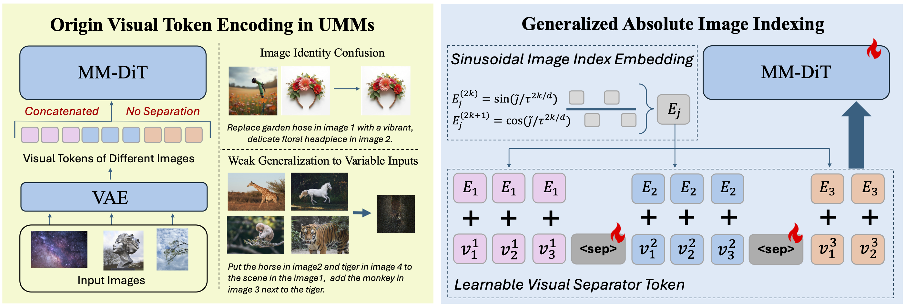

# Towards Generalized Multi-Image Editing for Unified Multimodal Models 

  

**TL;DR**: We propose a scalable multi-image editing framework for UMMs that explicitly encodes image identities to improve visual consistency and disambiguate references in the multi-image setting. By introducing learnable latent separators and sinusoidal index encoding—along with a high-fidelity benchmark—our method achieves stronger semantic consistency, visual fidelity, and cross-image integration than prior baselines.

**Pengcheng Xu | Peng Tang | Donghao Luo | Xiaobin Hu | Weichu Cui | Qingdong He | Zhennan Chen | Jiangning Zhang | Charles Ling | Boyu Wang**

> Western University
> 
> Tencent

## Benchmark

## Setup

## Evaluation

